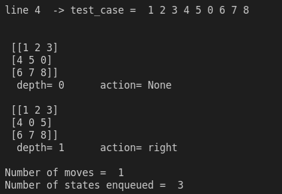

# Homework #1   CS 4365.002   Dr. Dan Moldovan
### NAME : ARMIN ZIAEI   DATE : 09/28/2021   NETID: AXZ172330
 

---

## Objective:
Implement an 8-puzzle solver.

- Description:
    - The 8-puzzle problem is played on a 3-by-3 grid with 8 square tileslabeled 1 through 8 and a blank tile.
    - Your goal is to rearrangeblocks so that they are in the order shown below.
    - You are permitted to slide blocks horizontally or vertically intothe blank tile.

 

- It should have the following algorithms:
    - Depth-first search
    - Iterative deepening search
    - A* search using two different suitable heuristics

 

---

## 1. Instructions on how to run the program

` bash$> python homework1.py <algorithm_name> <input_file_path> `

where: 
- algorithm_name can take one of the following values:
    - dfs : For running the Depth-first search algorithm
    - ids : For running the Iterative deepening search algorithm
    - astar1 : For running the A* algorithm with heuristic 1 (misplaced).
    - astar2 : For running the A* algorithm with heuristic 2 (manhattan).

 

- input_file_path : Path of the file containing the space separated input state.
    - For example - 0 1 3 4 2 5 7 8 6 
    - Note: 0 represents an empty tile

 

---

## 2. Sample input and its corresponding output

- Run the Program:
    - ` bash$> python homework1.py <algorithm_name> <input_file_path> `

  

- Input
    - test-cases.txt

 

- Output

    

---

## 3. Short comparative analysis of two heuristics used for A*

### A search heuristic h(n) is an estimate of the cost of the cheapest path from node **n** to a **goal** node.
- h(n) is arbitrary, non-negative, and problem-specific.
- If n is a goal node, h(n)=0.
- h(n) must be easy to compute (without search).

### There are 2 Heuristic function that used in this script 

- Manhattan Distance Heuristic:
    - The sum of the Manhattan distances of the tiles from their goal positions
- Misplaced Tile Heuristic:
    - The number of tiles that are NOT in their goal positions

 

### Constructing an Admissible Heuristic for 8-Puzzle
A tile can move from square A to square B

- if square A and square B are adjacent, and square B is blank.(can be used in the following Heuristics)
    - The Manhattan distance heuristic
    - The Misplaced tile heuristic

 

---
## References

1. S. J. Russell and P. Norvig, Artificial intelligence: A modern approach. Noida, India: Pearson India Education Services Pvt. Ltd., 2018.
2. “CS 486: Artificial intelligence.” [Online]. Available: https://cs.uwaterloo.ca/~a23gao/cs486686_s19/slides/lec04_search_informed_nosol.pdf. 
3. timzhang642, “timzhang642/8-puzzle,” GitHub. [Online]. Available: https://github.com/timzhang642/8-Puzzle. 
4. Microsoft, “Visual studio code - code editing. redefined,” RSS, 14-Apr-2016. [Online]. Available: https://code.visualstudio.com/.
 
